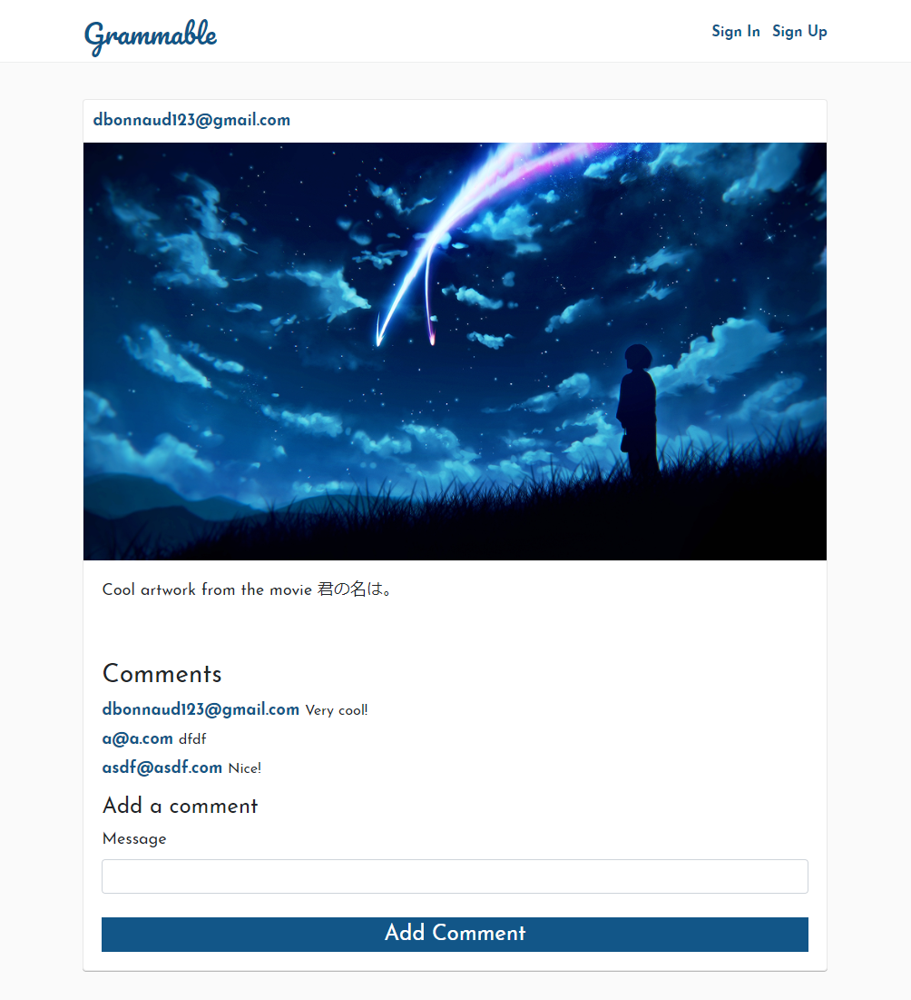

# Grammable
An Instagram clone that was built using industry-standard, test-driven development following numerous red/green/refactor cycles. Uses HTML/CSS/Bootstrap for the front-end, Ruby on Rails/PostgreSQL for the back-end, and RSpec for Test Driven Development. See more here: https://grammable-david-bonnaud.herokuapp.com/
 

